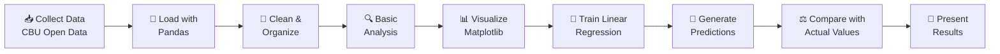
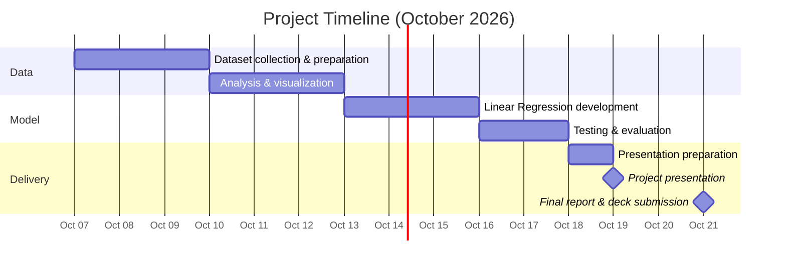

# 💵 Predicting USD/UZS Exchange Rate Using Linear Regression

**Analyzing historical USD/UZS exchange rates in Uzbekistan and forecasting future values with Machine Learning**

---

## 📑 Table of Contents

- [Project Overview](#-project-overview)
- [Project Objectives](#-project-objectives)
- [Dataset Source](#-dataset-source)
- [Methodology](#%EF%B8%8F-methodology)
- [Tools and Technologies](#%EF%B8%8F-tools-and-technologies)
- [Expected Outcomes](#-expected-outcomes)
- [Project Schedule](#-project-schedule)
- [Team Members](#-team-members)

---

## 📌 Project Overview

This project focuses on analyzing the historical **USD/UZS exchange rate** in Uzbekistan and predicting exchange rate values using a **Linear Regression** model.

The dataset will be obtained from the official **Open Data Portal of the Central Bank of the Republic of Uzbekistan**.

---

## 🎯 Project Objectives

| # | Objective |
|:-:|-----------|
| 1 | 📥 Collect historical USD/UZS exchange rate data |
| 2 | 🧹 Clean and prepare the dataset for analysis |
| 3 | 📈 Analyze the exchange rate trend over time |
| 4 | 📊 Visualize the historical exchange rate data |
| 5 | 🤖 Build a Linear Regression model using Python |
| 6 | 🔮 Predict future USD/UZS exchange rate values |
| 7 | ✅ Evaluate the prediction results |

---

## 🏦 Dataset Source

> **Central Bank of the Republic of Uzbekistan – Open Data Portal**
>
> 🔗 [https://cbu.uz/en/services/open_data/portal/](https://cbu.uz/en/services/open_data/portal/)

The dataset will contain historical USD/UZS exchange rate information related to Uzbekistan.

---

## ⚙️ Methodology

1. **Collect** the dataset from the Central Bank of Uzbekistan Open Data Portal.
2. **Load** the data into Python using Pandas.
3. **Clean** and organize the dataset.
4. **Analyze** the data with basic statistics.
5. **Visualize** the exchange rate trend using Matplotlib.
6. **Train** a Linear Regression model using Scikit-learn.
7. **Generate** predictions.
8. **Compare** predicted values with actual values.
9. **Present** the results using graphs and tables.

---

## 🛠️ Tools and Technologies

| Tool | Purpose |
|------|---------|
| 🐍 **Python** | Main programming language |
| ☁️ **Google Colab** | Cloud notebook environment |
| 🐼 **Pandas** | Data loading, cleaning and manipulation |
| 🔢 **NumPy** | Numerical computations |
| 📊 **Matplotlib** | Data visualization |
| 🤖 **Scikit-learn** | Linear Regression model and evaluation |
| 🐙 **GitHub** | Version control and collaboration |

---

## 🏁 Expected Outcomes

By the end of the project, we expect to:

- [ ] Obtain a clean dataset of historical USD/UZS exchange rates
- [ ] Identify the general trend of the exchange rate
- [ ] Develop a Linear Regression prediction model
- [ ] Generate predicted exchange rate values
- [ ] Visualize actual and predicted values
- [ ] Discuss the accuracy and limitations of the model

---

## 📅 Project Schedule

| 📆 Date | 📝 Task |
|---------|---------|
| **October 7–9, 2026** | Dataset collection and preparation |
| **October 10–12, 2026** | Data analysis and visualization |
| **October 13–15, 2026** | Linear Regression model development |
| **October 16–17, 2026** | Testing and evaluation |
| **October 18, 2026** | Presentation preparation |
| **October 19, 2026** | 🎤 Project Presentation |
| **October 21, 2026** | 📤 Final Report and Presentation Deck submission |

---

## 👥 Team Members

| 👤 Name | 🎓 Student ID | 🏫 Group |
|---------|:-------------:|:--------:|
| **Azizxon Abduraxmanov** | 2020390246 | E40B |
| **Mark Park** | 202390208 | E40B |
| **Shiyakhmetov Ramis** | 202390223 | E40B |
| **Nodirbek Rustamov** | 202390234 | E40B |

---

⭐ *If you find this project useful, consider giving it a star!* ⭐

